

<picture><source media="(prefers-color-scheme: dark)" srcset="assets/dark/header.svg"/>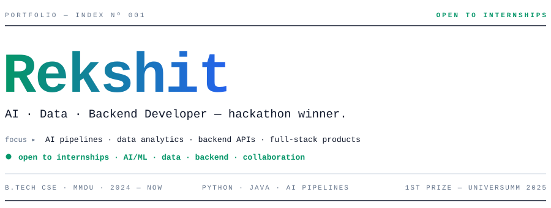</picture>

<picture><source media="(prefers-color-scheme: dark)" srcset="assets/dark/s01.svg"/>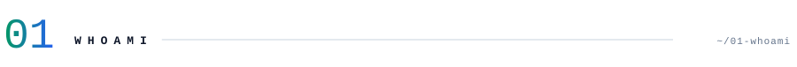</picture>
<picture><source media="(prefers-color-scheme: dark)" srcset="assets/dark/whoami.svg"/>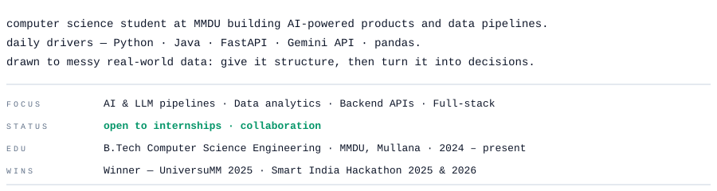</picture>
<picture><source media="(prefers-color-scheme: dark)" srcset="assets/dark/s02.svg"/>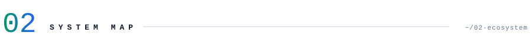</picture>
<picture><source media="(prefers-color-scheme: dark)" srcset="assets/dark/ecosystem.svg"/>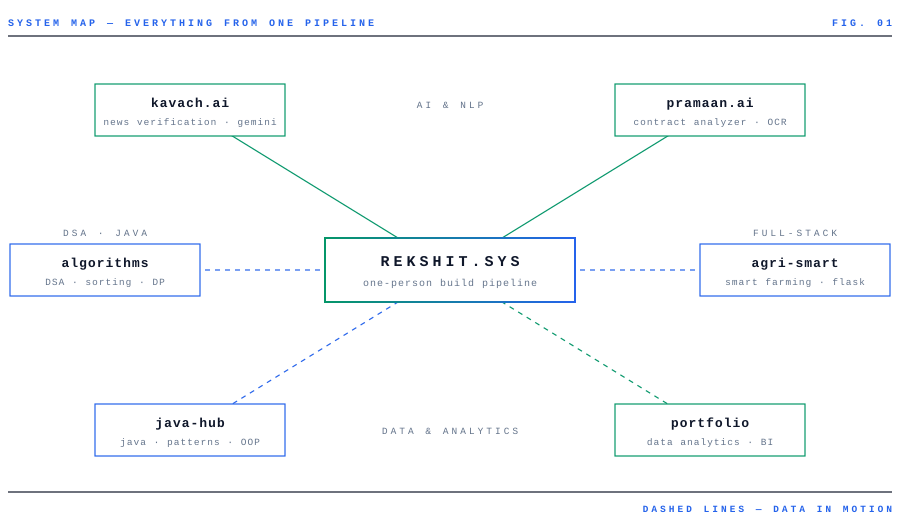</picture>
<picture><source media="(prefers-color-scheme: dark)" srcset="assets/dark/s03.svg"/>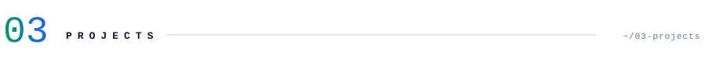</picture>
<a href="https://github.com/Rekshit/Kavach-AI"><picture><source media="(prefers-color-scheme: dark)" srcset="assets/dark/project-01.svg"/>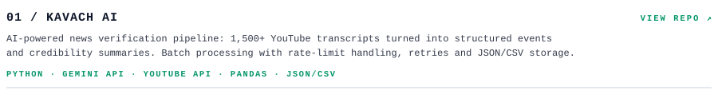</picture></a>
<a href="https://github.com/Rekshit/Pramaan-AI"><picture><source media="(prefers-color-scheme: dark)" srcset="assets/dark/project-02.svg"/>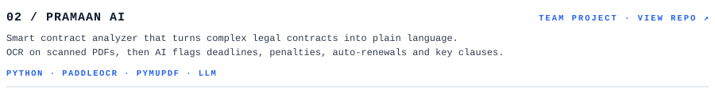</picture></a>
<a href="https://github.com/Rekshit/Agri-Smart"><picture><source media="(prefers-color-scheme: dark)" srcset="assets/dark/project-03.svg"/>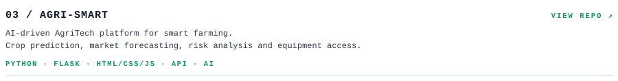</picture></a>
<a href="https://github.com/Rekshit/My-Internship-Portfolio"><picture><source media="(prefers-color-scheme: dark)" srcset="assets/dark/project-04.svg"/>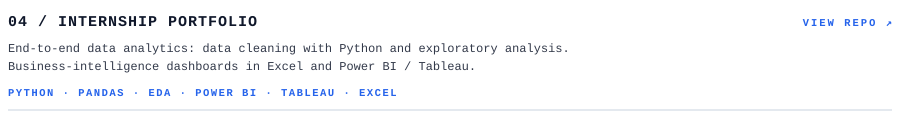</picture></a>
<a href="https://github.com/Rekshit/Java-Mastery-Hub"><picture><source media="(prefers-color-scheme: dark)" srcset="assets/dark/project-05.svg"/>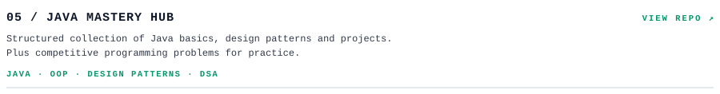</picture></a>
<a href="https://github.com/Rekshit/Data-Analysis-and-Algorithm"><picture><source media="(prefers-color-scheme: dark)" srcset="assets/dark/project-06.svg"/>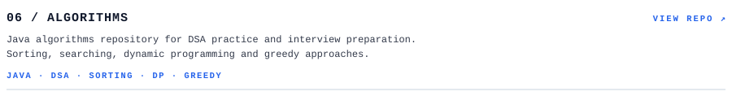</picture></a>
<picture><source media="(prefers-color-scheme: dark)" srcset="assets/dark/s04.svg"/>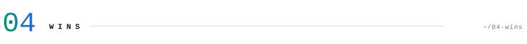</picture>
<picture><source media="(prefers-color-scheme: dark)" srcset="assets/dark/wins.svg"/>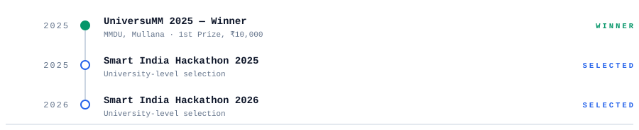</picture>
<picture><source media="(prefers-color-scheme: dark)" srcset="assets/dark/s05.svg"/>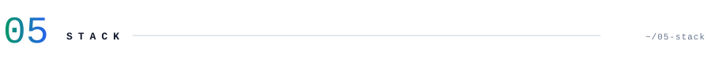</picture>
<picture><source media="(prefers-color-scheme: dark)" srcset="assets/dark/stack.svg"/>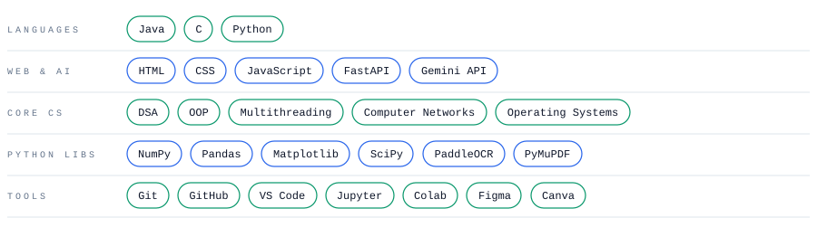</picture>
<picture><source media="(prefers-color-scheme: dark)" srcset="assets/dark/s06.svg"/>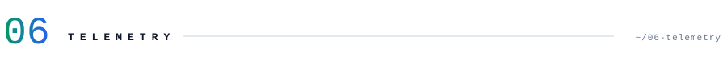</picture>

<picture><source media="(prefers-color-scheme: dark)" srcset="https://github-readme-stats.vercel.app/api?username=Rekshit&show_icons=true&hide_border=true&count_private=true&include_all_commits=true&bg_color=00000000&title_color=34d399&icon_color=60a5fa&text_color=cbd5e1"/></picture>
<picture><source media="(prefers-color-scheme: dark)" srcset="https://github-readme-stats.vercel.app/api/top-langs/?username=Rekshit&layout=compact&hide_border=true&hide=jupyter%20notebook&langs_count=6&bg_color=00000000&title_color=34d399&text_color=cbd5e1"/></picture>

<picture><source media="(prefers-color-scheme: dark)" srcset="https://streak-stats.demolab.com?user=Rekshit&hide_border=true&background=00000000&ring=60a5fa&fire=34d399&currStreakNum=e2e8f0&currStreakLabel=34d399&sideNums=e2e8f0&sideLabels=94a3b8&dates=94a3b8&stroke=334155"/></picture>

<picture><source media="(prefers-color-scheme: dark)" srcset="https://raw.githubusercontent.com/Rekshit/Rekshit/output/snake-dark.svg"/></picture>

<picture><source media="(prefers-color-scheme: dark)" srcset="assets/dark/footer.svg"/>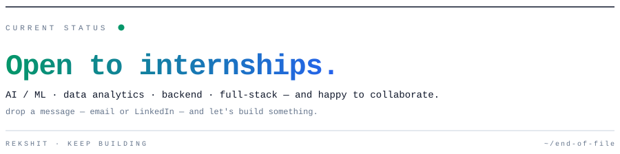</picture>
