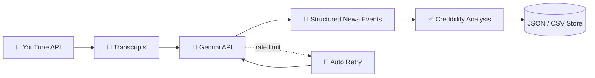

[README.md](https://github.com/user-attachments/files/32972664/README.md)
<!-- ============ HEADER ============ -->


<div align="center">

<a href="https://github.com/Rekshit">
  
</a>

<br/>


<!-- Replace the placeholders below with your real links -->
<a href="https://www.linkedin.com/in/YOUR-LINKEDIN/"></a>
<a href="mailto:YOUR-EMAIL@gmail.com"></a>
<a href="https://YOUR-PORTFOLIO.com"></a>

</div>

---

## 🧠 About Me

```python
class Rekshit:
    def __init__(self):
        self.role        = "AI / Data / Backend Developer"
        self.currently   = ["Building Kavach AI", "Shipping Pramaan AI", "Grinding DSA in Java"]
        self.strengths   = ["Data pipelines", "LLM + API integration", "Problem solving", "Team hackathons"]
        self.achievements = ["🏆 Winner – UniversuMM 2025", "🇮🇳 Smart India Hackathon 2025 & 2026 (University-level selection)"]
        self.fun_fact    = "I make AI read 1,500+ YouTube transcripts so you don't have to ☕"

    def say_hi(self):
        print("Let's build something awesome together!")
```

---

## 🏆 Achievements

<div align="center">

| 🥇 | Achievement | Event |
|:--:|:--|:--|
| 🏆 | **Winner – 1st Prize (₹10,000)** | UniversuMM 2025, MMDU Mullana |
| 🇮🇳 | **University-Level Selection** | Smart India Hackathon 2025 |
| 🇮🇳 | **University-Level Selection** | Smart India Hackathon 2026 |

</div>

---

## 🚀 Featured Projects

<div align="center">

### 🛡️ Kavach AI – Trustified News Platform
`Python` `Gemini API` `YouTube API` `Pandas` `JSON/CSV`

</div>

> An AI-powered news aggregation and verification pipeline built to fight misinformation.

- 📰 Processes **1,500+ YouTube transcripts** and extracts structured news events and summaries for **credibility analysis**
- ⚙️ Batch-processing data pipeline with **API rate-limit handling**, **automated retries**, and structured **JSON/CSV storage**
- 🔍 Built with process discipline and a troubleshooting mindset: pipelines that fail gracefully and recover on their own



---

<div align="center">

### ⚖️ Pramaan AI – Smart Contract Analyzer (Team Project)
`Python` `OCR` `AI/LLM`

</div>

> Converts complex legal contracts into simple, easy-to-understand language.

- 🔎 **OCR** extracts text from scanned PDFs and sends it for AI-based analysis
- 🚩 Highlights **deadlines, penalties, auto-renewals** and key clauses
- 🎙️ Roadmap: **voice-based queries** and **direct photo uploads** so anyone can ask questions about their contracts

---

<div align="center">

### 🌾 Agri-Smart – AI-Driven AgriTech Platform
`Python` `Flask` `HTML/CSS/JS` `AI`

</div>

> A full-stack smart-farming platform for **crop prediction, market forecasting, risk analysis and equipment access**.

[](https://github.com/Rekshit/Agri-Smart)

---

## 📌 More Repositories

<div align="center">

<a href="https://github.com/Rekshit/Data-Analysis-and-Algorithm"></a>
<a href="https://github.com/Rekshit/Java-Mastery-Hub"></a>
<a href="https://github.com/Rekshit/My-Internship-Portfolio"></a>
<a href="https://github.com/Rekshit/Agri-Smart"></a>

</div>

---

## 🛠️ Tech Arsenal

<div align="center">


</div>

---

## 📊 Contribution & Productivity Dashboard

<div align="center">

### 🔥 GitHub Stats


### ⚡ Streak


### 📈 Activity Graph


### 🏅 Trophy Cabinet


### 🐍 Contribution Snake


### 🌐 3D Contribution Skyline

<!-- Generate once at https://skyline.github.com, save a screenshot into /assets and link here -->
<!--  -->

</div>

<details>
<summary><b>⏱️ Weekly Coding Time (WakaTime) — click to set up</b></summary>

1. Create a free account at [wakatime.com](https://wakatime.com) and install the VS Code plugin.
2. Enable *Public Profile* in WakaTime settings.
3. Add this to the README:

```md
[](https://wakatime.com/@YOUR_WAKATIME_USERNAME)
```

</details>

---

## 🎯 Currently

| 🔭 Working on | 🌱 Learning | 💬 Ask me about | ⚡ Fun fact |
|:--|:--|:--|:--|
| Kavach AI, Pramaan AI | System design, advanced DSA, LLM pipelines | Python, Java, Data Analytics, Hackathons | Won 1st prize at UniversuMM 2025 |

---

## 🤝 Let's Connect

<div align="center">

**Got a cool idea, a hackathon team to form, or an internship opportunity?**
**My inbox is open. 📬**

<a href="https://github.com/Rekshit?tab=repositories"></a>

<br/><br/>

⭐ *If you like my work, drop a star on any repo. It makes my day!* ⭐

</div>


